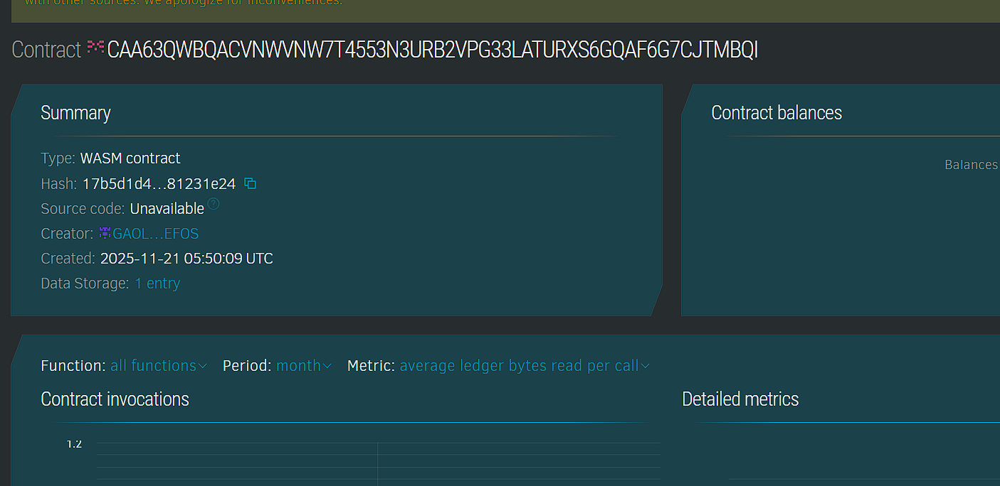

# StreamSync Server

## Project Description

StreamSync Server is a blockchain-powered decentralized file-sharing platform that combines the performance of async Rust (Tokio) with the security and transparency of Stellar Soroban smart contracts. The system provides lightweight, high-performance file synchronization and sharing capabilities while maintaining an immutable record of all file transactions, permissions, and access logs on the blockchain.

## Project Vision

To create a next-generation file-sharing infrastructure that eliminates centralized points of failure while delivering enterprise-grade performance. Our vision is to empower users with complete control over their data through cryptographic ownership, enabling secure peer-to-peer file transfers with verifiable access permissions, all while maintaining the speed and reliability expected from modern async server architectures.

## Key Features

- **Decentralized File Registry**: All file metadata is stored on the Stellar blockchain ensuring immutability and transparency
- **Async Performance**: Built with Tokio for non-blocking, high-throughput file operations
- **Cryptographic Ownership**: Files are tied to blockchain addresses ensuring verifiable ownership
- **Content Verification**: File hashes stored on-chain for integrity verification and deduplication
- **Granular Sharing Permissions**: Share files with specific users with customizable access controls
- **Time-Limited Access**: Set expiration times on shared files for temporary access
- **Download Tracking**: Immutable record of all file downloads for audit purposes
- **Public/Private Files**: Toggle file visibility between public and private modes
- **User Statistics**: Track individual user file counts and activity
- **Platform Analytics**: Comprehensive statistics on files, shares, and downloads
- **Permission Revocation**: Instantly revoke access to shared files when needed
- **Lightweight Architecture**: Minimal resource footprint suitable for edge deployment

## Future Scope

- **IPFS Integration**: Store actual file content on IPFS with blockchain references for true decentralization
- **End-to-End Encryption**: Client-side encryption ensuring only authorized parties can decrypt files
- **Streaming Support**: Real-time file streaming for large media files using chunked transfers
- **Resume Capability**: Interrupted downloads can resume from where they stopped
- **Version Control**: Track file versions with rollback capability
- **Folder Synchronization**: Sync entire directories across multiple devices
- **Collaborative Editing**: Real-time collaborative document editing with conflict resolution
- **WebSocket Notifications**: Push notifications for file updates, shares, and downloads
- **Bandwidth Throttling**: Configurable upload/download speed limits per user
- **Storage Quotas**: Implement storage limits with blockchain-based quota tracking
- **Payment Integration**: Pay-per-download or subscription models using Stellar tokens
- **CDN Distribution**: Distribute popular files across multiple nodes for faster access
- **Mobile Applications**: Native iOS and Android apps for mobile file sync
- **Desktop Sync Client**: Background sync daemon for Windows, macOS, and Linux
- **API Gateway**: RESTful and GraphQL APIs for third-party integrations
- **File Preview**: Generate thumbnails and previews for images, videos, and documents
- **Search Functionality**: Full-text search across file names and metadata
- **Audit Logs**: Detailed activity logs for compliance and security monitoring
- **Multi-Region Support**: Geo-distributed storage for low-latency global access
- **Zero-Knowledge Proofs**: Verify file ownership without revealing content
- **Smart Contract Automation**: Automated file sharing based on predefined conditions
- **Deduplication**: Content-addressable storage to eliminate duplicate files
- **Compression**: Automatic file compression for bandwidth optimization
- **Virus Scanning**: Integrated malware detection before file distribution
- **Retention Policies**: Automatic file cleanup based on configurable retention rules
- **Backup Integration**: Scheduled backups to multiple storage backends
- **Access Analytics**: Detailed insights on file access patterns and user behavior
- **Federation**: Connect multiple StreamSync servers for distributed file sharing
- **Offline Mode**: Queue operations when offline and sync when connection restored
- **File Comments**: Add comments and annotations to shared files

## Contract Details
Contract ID: CAA63QWBQACVNWVNW7T4553N3URB2VPG33LATURXS6GQAF6G7CJTMBQI
